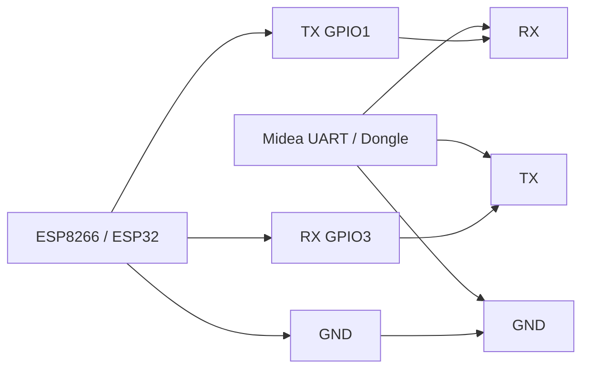

# Подключение UART и типовые причины, почему проект может не работать

## Быстрая суть

Для UART-подключения нужно помнить три базовых правила:

- `TX` одной стороны подключается к `RX` другой стороны
- `RX` одной стороны подключается к `TX` другой стороны
- `GND` должен быть общим

Если перепутать `TX/RX`, не подключить общий `GND` или оставить конфликтующий `logger`, проект может определяться в ESPHome, но кондиционер не будет нормально отвечать на команды.

## Мини-схема подключения



## Простое правило подключения

Правильная схема такая:

- `ESP TX -> Midea RX`
- `ESP RX -> Midea TX`
- `ESP GND -> Midea GND`

Неправильная схема:

- `TX -> TX`
- `RX -> RX`

## Что проверить в первую очередь

### 1. Проверить, не перепутаны ли `TX` и `RX`

В этом проекте пример такой:

```yaml
uart:
  tx_pin: GPIO1
  rx_pin: GPIO3
  baud_rate: 9600
```

Это означает:

- `GPIO1` передаёт данные из ESP
- `GPIO3` принимает данные в ESP

Если связь не поднимается, первое действие:

- перепроверить проводку `TX/RX`

### 2. Проверить общий `GND`

Даже если `TX/RX` подключены правильно, без общего `GND` UART может не работать или работать нестабильно.

### 3. Проверить скорость UART

Для этого проекта должна быть:

```yaml
uart:
  baud_rate: 9600
```

Если скорость не совпадает с ожидаемой для Midea, обмен будет некорректным.

### 4. Проверить конфликт с `logger`

Если `TX` и `RX` подключены к аппаратным UART-пинам ESP, нужно проверить, не конфликтует ли с ними стандартный логгер.

В этом проекте используется:

```yaml
logger:
  baud_rate: 0
```

Это нужно потому, что:

- аппаратный UART ESP8266 использует те же линии, что и обмен с кондиционером
- если serial logger остаётся активным, он может мешать Midea UART

Практическое правило:

- если используется аппаратный UART на тех же пинах, ставить `baud_rate: 0`
- если конфликта нет и используется другой способ связи, блок можно не менять

### 5. Проверить уровень сигнала

По документации Midea часто ожидается `5V` логика.

Если ESP работает на `3.3V`, а адаптер/кондиционер ждёт `5V`, может понадобиться преобразователь уровней.

## Типовые симптомы и вероятные причины

### Симптом: устройство в ESPHome есть, но кондиционер не реагирует

Проверить:

- перепутаны `TX/RX`
- нет общего `GND`
- неправильная скорость `9600`
- конфликтует `logger`
- неподходящий уровень сигнала

### Симптом: прошивка загружается, но связь нестабильная

Проверить:

- качество проводов и соединений
- общий `GND`
- преобразователь уровней
- питание ESP

### Симптом: команды проходят не всегда

Проверить:

- `timeout`
- `num_attempts`
- стабильность UART-линии
- корректность аппаратного подключения

## Мини-чеклист перед первой диагностикой

1. `ESP TX -> Midea RX`
2. `ESP RX -> Midea TX`
3. `GND -> GND`
4. `baud_rate: 9600`
5. если аппаратный UART занят под Midea, проверить `logger:` и при конфликте поставить `baud_rate: 0`
6. при необходимости проверить преобразование `3.3V -> 5V`

## Где это связано с основным примером

См. также:

- `examples/climat-komnata.yaml`
- `docs/implementation-guide.md`
